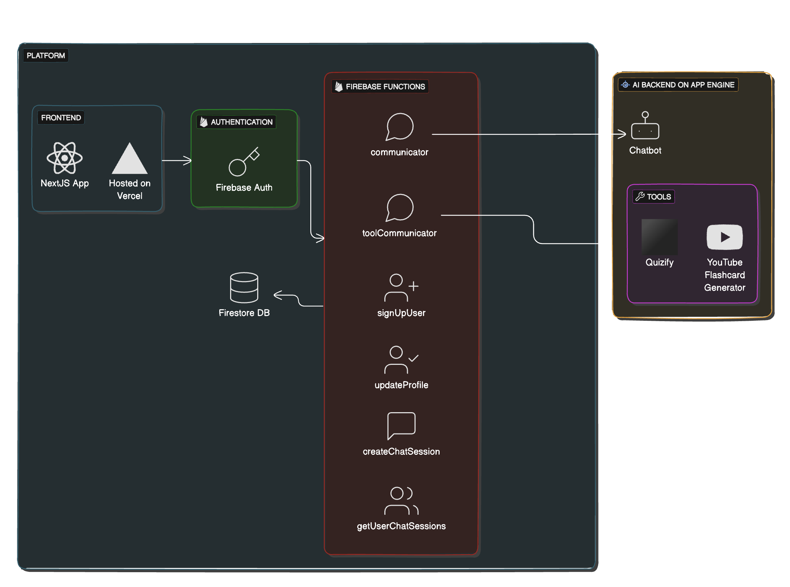

# Marvel AI Platform
Marvel is an open source project by Radical having chatbot and smart tools for teachers.

## Table of Contents

- [Architecture](#Architecture)
- [Folder Structure](#folder-structure)
- [Setup](#Setup)
- - [Local Development](#local-development)
- - [Cloud Deployment](#cloud-deployment)
- [Contributing](#Contributing)
- [License](#license)

## Architecture
The "Marvel" platform is structured into two main components: Firebase and AI. The Firebase side, detailed in this repository, encompasses both the frontend, developed with NextJS and hosted on Firebase Hosting, and the backend, which includes user management and session handling via Firebase Functions like `signUpUser` and `createChatSession`. The `communicator` and `toolCommunicator` functions act as proxies, facilitating interaction between the Firebase infrastructure and the AI services, ensuring seamless data flow and integration. Firestore DB is utilized for data storage. The AI components, housed in a separate repository, include a chatbot and tools like "Quizify" and "YouTube Flashcard Generator." 

### Folder Structure
## Folder Structure Overview

- **`/frontend`**:
  Contains all the files related to the front-end application, including the NextJS app and associated resources.

- **`/functions`**:
  Houses the Firebase Functions, which are serverless functions responsible for backend processes such as AI chatbot and tools communicators

## Key Files
- **`firebase.json`**:
  Contains configuration settings for Firebase services such as hosting and rules.

- **`firestore.indexes.json`**:
  Manages custom indexing for Firestore to optimize query performance.

- **`firestore.rules`**:
  Security rules for Firestore database, defining read/write permissions.

- **`package.json`** & **`package-lock.json`**:
  Defines the project’s global dependencies

## Prerequisites
- Node.js (v14 or later)
- Firebase CLI (v9.10.0 or later)
- Google Firebase Account

## Setup
To set up the project, follow these steps:

## Local Development
1. Clone the repository: `git clone https://github.com/radicalxdev/marvel-platform`
2. Create your firebase project on google firebase console
3. Create a firestore database instance
4. Get firebase config from firebase project settings in firebase console and save it to .env (create in root of this project, see sample.env for refrence)
5. Install Firebase CLI by running the following in terminal: `npm install -g firebase-tools`
6. Login to firebase CLI by running the following command: `firebase login`.

### Backend
1. Navigate to back-end project directory: `cd functions`
2. Install dependencies: `npm install`
3. Run for local testing: `firebase serve --only functions`

### Frontend
1. Navigate to front-end project directory: `cd frontend`
2. Install dependencies: `npm install`
3. Run for local testing: `npm run dev`

### Local Emulator (Optional)
#### Setup
1. Open the terminal and to start the emulators, run the following command: `npm run emulators`
2. Open another terminal simultaneously and start the frontend project, run the following command: `npm run frontend:dev`

## Cloud Deployment
1. Clone the repository: `git clone https://github.com/radicalxdev/marvel-platform`
2. Navigate to back-end project directory: `cd functions`
3. Install dependencies: `npm install`
4. Navigate to front-end directory: `cd ../frontend`
5. Install dependencies: `npm install`
5. Navigate to the root directory and run deploy: `cd .. && npm run deploy`

## Contributing

If you would like to contribute to the project, please follow the guidelines in the `CONTRIBUTING.md` file.

## License

This project is licensed under the [MIT License](LICENSE).
